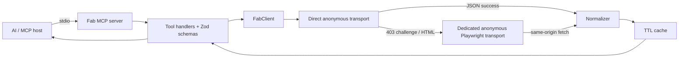
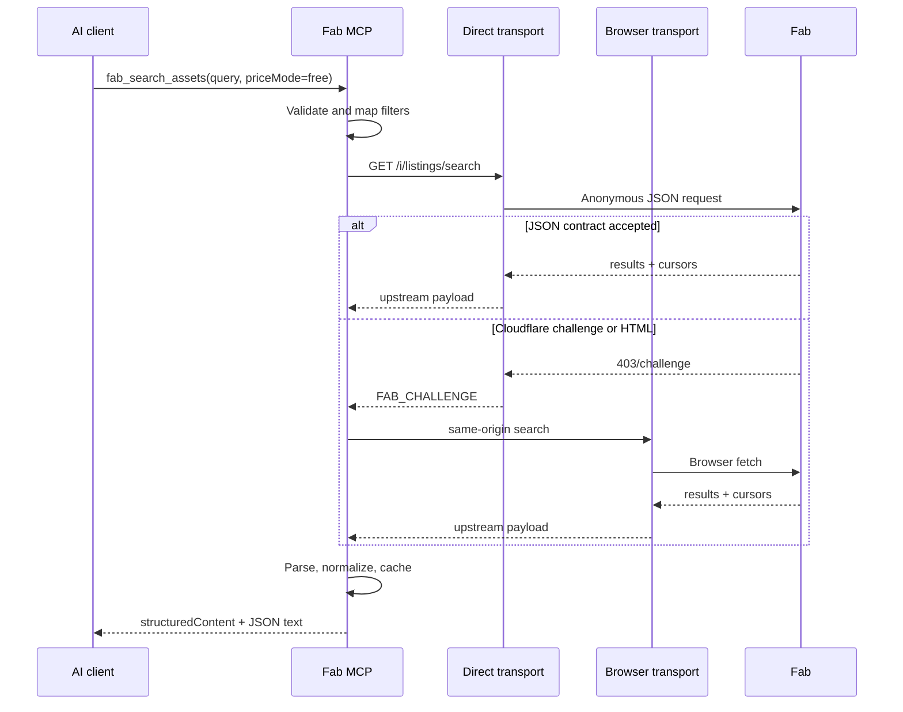
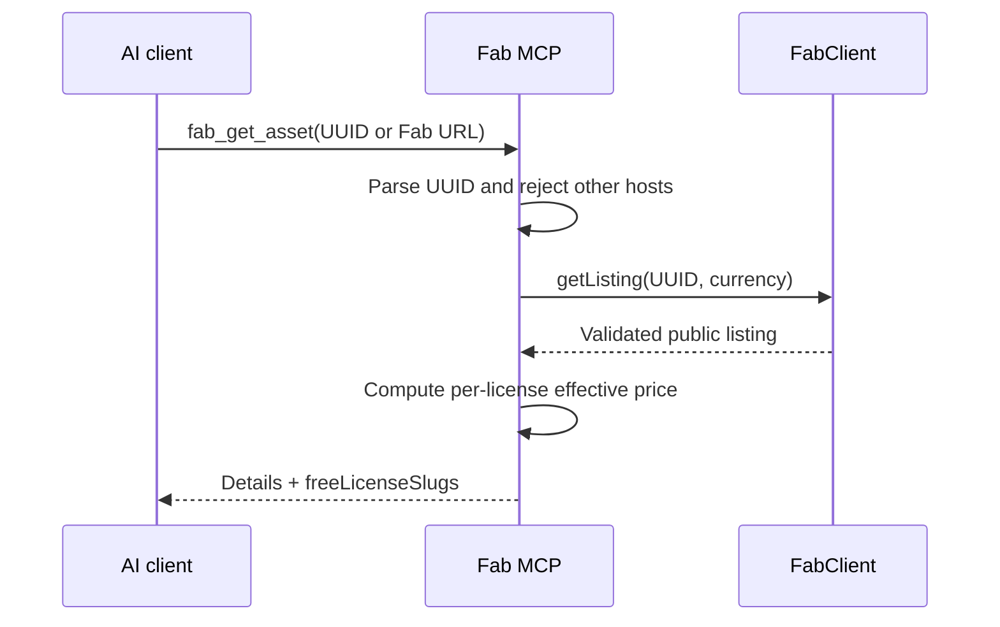

# PRD: Read-only Fab Asset Search MCP

**Status:** Implementation complete; release blocked on the live anonymous-browser gate  
**Research date:** 2026-07-28  
**Complexity:** 8 → HIGH mode

Complexity score:

- +3: expected to touch more than 10 files
- +2: new MCP server from scratch
- +2: browser lifecycle, request serialization, caching, and fallback state
- +1: undocumented external service integration

## 1. Context

**Problem:** AI agents do not have a compact, deterministic interface for finding Fab marketplace assets, especially free assets, without manually driving Fab's search UI.

**Goal:** Ship a local, read-only MCP server that searches Fab listings, defaults to free assets, returns normalized structured results, exposes listing details and live filter metadata, and degrades safely when Fab's bot protection prevents direct HTTP access.

**Assumptions:**

- This is a greenfield TypeScript project named `fab-mcp`.
- Version 1 is a local stdio MCP, not a hosted multi-user service.
- Version 1 is read-only. Purchasing, adding to library/cart/wishlist, downloading, and account/library inspection are out of scope.
- Search and public listing details must work without an Epic account.
- A dedicated anonymous browser profile may be used as a fallback. The MCP must not copy, print, or persist cookies or tokens from the user's normal Chrome profile.

### Files and sources analyzed

There is no existing project code in the supplied workspace. Research used:

- Live Fab homepage, search, and listing pages in the user's Chrome session.
- The current Fab frontend bundle, especially:
  - [`6b5a95f6d979afc22364a632e243b7ef-v1.js`](https://static.fab.com/static/builds/web/dist/6b5a95f6d979afc22364a632e243b7ef-v1.js)
  - [`54ecc7daf46f6db108f1b87d08e6dbcd-v1.js`](https://static.fab.com/static/builds/web/dist/54ecc7daf46f6db108f1b87d08e6dbcd-v1.js)
- [Fab's official search and purchasing documentation](https://dev.epicgames.com/documentation/fab/purchasing-and-downloading-assets-in-fab?lang=en-US).
- [Fab's official marketplace overview](https://www.fab.com/o/about).
- [MCP TypeScript server guide](https://github.com/modelcontextprotocol/typescript-sdk/blob/main/docs/server.md).
- [MCP tools specification](https://modelcontextprotocol.io/specification/2025-06-18/server/tools).
- An [unofficial Fab script](https://gist.github.com/jo-chemla/b673d4a074562a794f4cda72437b4759) used only to corroborate the internal search path and cursor response shape.

### Current behavior and technical findings

| Finding                                                                                                                                                                   | Evidence                                                                                                                                |                                          Confidence | Design consequence                                                                            |
| ------------------------------------------------------------------------------------------------------------------------------------------------------------------------- | --------------------------------------------------------------------------------------------------------------------------------------- | --------------------------------------------------: | --------------------------------------------------------------------------------------------- |
| Fab's public route accepts `q`, `is_free=1`, and `sort_by=-relevance`.                                                                                                    | Live Chrome search at `/search?q=forest&is_free=1&sort_by=-relevance`; the UI showed a Free filter pill and only free-starting results. |                                           Confirmed | MCP defaults `priceMode` to `free`.                                                           |
| Search supports channels, product/listing types, categories, formats, tags, publisher, license, rating, dates, AI flags, and engine compatibility.                        | Current bundle filter schema plus official Fab search documentation.                                                                    |                                           Confirmed | Expose a stable v1 subset and a `fab_list_filters` discovery tool.                            |
| Repeated filters use repeated query keys.                                                                                                                                 | Fab-generated links repeat keys such as `sellers`; current bundle marks relevant fields as `multiple`.                                  |                                                High | Serializer must use `URLSearchParams.append`, never comma-join arrays.                        |
| Pagination is cursor-based. The current client reads `result.cursors.next` and sends it back as `cursor`.                                                                 | Current bundle and independent code corroboration.                                                                                      |                                           Confirmed | Cursor is opaque; never parse or synthesize it.                                               |
| Default result page size is 24.                                                                                                                                           | Current bundle sets the search skeleton from `apiPageSize ?? 24`.                                                                       |                                           Confirmed | `limit` defaults to 24 and is capped at 24 in v1.                                             |
| Public operation names include `search.listings` and `listing.getPublicById`; the listing path is `/i/listings/{uuid}`.                                                   | Current bundle.                                                                                                                         |                                           Confirmed | Search and detail use separate normalized schemas.                                            |
| The internal search path is `/i/listings/search`.                                                                                                                         | A bounded anonymous probe returned `200 application/json` on some runs and a Cloudflare challenge on others.                            |                                           Confirmed | Treat the route as unsupported and availability as intermittent; retain a live contract gate. |
| Search responses have `results` and `cursors: { next, previous }`.                                                                                                        | Current bundle's pagination default state and `getNextParams`.                                                                          |                                           Confirmed | Normalize `nextCursor` and omit `previous` from the initial v1 tool unless needed.            |
| Search result entities include identifiers, title, publisher, listing type, formats, thumbnails, ratings, licenses/starting price, discount state, and AI/maturity flags. | Current listing-card code in the bundle.                                                                                                |                                           Confirmed | Return only fields present in the response; optional fields stay optional.                    |
| Detail entities include description, category, tags, formats/files, licenses and price tiers, publication/update dates, AI flags, maturity, and media.                    | Live listing page and current bundle.                                                                                                   |                                           Confirmed | `fab_get_asset` computes free licenses from per-license effective prices.                     |
| `is_free=1` means at least one free/effectively-free offer, not necessarily that every license tier is free.                                                              | A live free search result opened to a listing with multiple license choices; bundle compares each license price tier separately.        |                                           Confirmed | Never label all licenses free based only on the search flag.                                  |
| "Limited-Time Free" is a curated promotional surface distinct from the general free filter.                                                                               | Live homepage and `/limited-time-free` route; official Fab overview.                                                                    |                                           Confirmed | Provide a separate `fab_list_limited_time_free` tool.                                         |
| Search and browsing are public; sign-in is required to acquire/add content to a library.                                                                                  | Official Fab documentation.                                                                                                             |                                           Confirmed | No Epic authentication in v1.                                                                 |
| The inspected Chrome profile was visibly signed in, but no cookies or session stores were read. Search itself did not need an account-specific action.                    | Live Chrome UI.                                                                                                                         |                 Confirmed for the inspected session | Do not make authenticated state a dependency. Verify a clean anonymous context in Phase 0.    |
| A standalone `curl` request to Fab currently receives a Cloudflare challenge (`403` with `cf-mitigated: challenge`).                                                      | Live 2026-07-28 probe.                                                                                                                  |               Confirmed in the research environment | Direct HTTP alone is not a reliable architecture.                                             |
| Direct top-level navigation to `/i/listings/search` was blocked by the Chrome control extension, so this run did not capture the raw JSON response.                       | Live Chrome inspection.                                                                                                                 |                                           Confirmed | Phase 0 must use the implementation's own dedicated Playwright context and same-origin fetch. |
| Fab does not publish a public marketplace search API in the official documentation found during research.                                                                 | Official documentation search.                                                                                                          |                                                High | Treat `/i/*` as unsupported and version-drift-prone; add contract tests and a policy gate.    |

### Implementation and live-gate snapshot

The v0.1.0 implementation now covers all four proposed tools and passes its
deterministic type, contract, integration, MCP stdio, lifecycle, privacy, and
packaging checks. Live release remains blocked:

- Direct anonymous search is intermittent: it returned valid JSON and an opaque
  cursor in bounded runs, but also returned `403` with
  `cf-mitigated: challenge`.
- Clean headless Chromium profiles receive the same challenge.
- The user-requested Chrome control integration independently reproduced the
  same result on the public free-search URL: page title `Just a moment...`,
  HTTP `403`, with no `/i/listings/search` request reaching the application.
- Waiting 20 seconds did not clear the security check, and navigating to the
  Fab homepage first produced the same pre-application `403`.
- A final inspection of the current Fab frontend bundles found
  `search.listings`, `listing.getPublicById`, and the same-origin `/i/listings`
  route, but no separate public catalog API origin that could replace it.
- Headed mode uses only an MCP-owned profile, opens Fab proactively, and gives a
  human a bounded grace period to complete visible verification. It does not
  automate or bypass the challenge.
- On a host without a usable graphical browser, the built MCP now returns a
  safe `FAB_UPSTREAM_UNAVAILABLE` error within the client deadline instead of
  hanging.
- No user Chrome/Epic cookies, tokens, storage, or profile files were read or
  copied.

This is therefore a conditional implementation, not a release-ready claim.
The release gate in section 13 remains authoritative.

### Observed filter schema

The current frontend bundle recognizes:

`q`, `sort_by`, `asset_formats`, `average_rating`, `categories`, `channels`,
`compatible_universes`, `explain_query`, `file_size`, `in`,
`is_ai_forbidden`, `is_ai_generated`, `is_author_seller`, `is_free`,
`is_discounted`, `show_private`, `min_discount_percentage`, `licenses`,
`listing_types`, `metahuman_engine_version`, `override_mature_preference`,
`polygons_count`, `price`, `published_since`, `seller`, `sellers`, `tags`,
`styles`, `technical_features`, `unreal_engine_distribution_method`,
`unreal_engine_engine_versions`, `unreal_engine_target_platforms`,
`unity_version`, `unreal_engine_version`, `added_since`, `ai_only`,
`excluded_sellers`, `source`, and `bundle_id`.

Version 1 intentionally exposes only the stable buyer-facing subset described below.

### Observed sort tokens

| MCP value          | Fab token                  |
| ------------------ | -------------------------- |
| `relevance`        | `-relevance`               |
| `rating`           | `-ratings.averageRating`   |
| `newest`           | `-firstPublishedAt`        |
| `oldest`           | `firstPublishedAt`         |
| `price_asc`        | `price`                    |
| `price_desc`       | `-price`                   |
| `discount_desc`    | `-min_discount_percentage` |
| `recently_updated` | `-publishedAt`             |

Do not expose internal sorts such as `listingTypeWeight` in v1.

## 2. Product requirements

### Primary user stories

1. As an AI agent, I can search "forest environment" and receive free assets by default.
2. As an AI agent, I can explicitly include paid assets.
3. As an AI agent, I can filter by channel, listing type, category, format, tags, publisher, license, rating, publication date, AI-generation status, and AI-use permission.
4. As an AI agent, I can paginate using an opaque cursor without rebuilding a search URL.
5. As an AI agent, I can inspect a listing's formats, licenses, price tiers, technical metadata, and canonical Fab URL.
6. As an AI agent, I can discover valid current filter values instead of guessing slugs.
7. As an AI agent, I can separately ask for Fab's current limited-time-free promotions.
8. As a user, I am never asked for Epic credentials merely to search public assets.

### Non-goals for v1

- Adding free products to the library.
- Cart, purchase, checkout, wishlist, or download actions.
- Reading "My Library", ownership, account, wallet, entitlements, or order data.
- Copying cookies from Chrome or accepting raw cookie/token input.
- Solving or bypassing CAPTCHA/Cloudflare challenges.
- Mirroring or bulk-indexing Fab's catalog.
- Downloading, redistributing, embedding, or training on asset files or previews.
- Hosted multi-tenant deployment.
- Semantic reranking or local vector indexing.

## 3. MCP interface

All tools are read-only and declare:

```ts
annotations: {
  readOnlyHint: true,
  destructiveHint: false,
  idempotentHint: true,
  openWorldHint: true
}
```

Every successful tool returns both:

- `structuredContent` conforming to an explicit output schema.
- A compact JSON text content block for clients that do not consume structured content.

Every tool-level failure returns `isError: true` with a stable error code and actionable message.

### Tool: `fab_search_assets`

**Purpose:** Search public Fab listings. Free assets are the default.

```ts
type SearchInput = {
  query?: string; // 0..200 chars
  priceMode?: "free" | "any" | "range"; // default "free"
  minPrice?: number; // only with priceMode "range"
  maxPrice?: number; // only with priceMode "range"
  currency?: string; // ISO-4217, default "USD"
  channels?: string[]; // e.g. unreal-engine, unity, uefn, metahuman
  listingTypes?: string[];
  categories?: string[];
  formats?: string[];
  tags?: string[];
  licenses?: string[];
  publisher?: string;
  minimumRating?: 1 | 2 | 3 | 4 | 5;
  publishedSince?: string; // YYYY-MM-DD
  aiGenerated?: boolean;
  allowsAiUse?: boolean; // inverse mapping to is_ai_forbidden
  sort?:
    | "relevance"
    | "rating"
    | "newest"
    | "oldest"
    | "price_asc"
    | "price_desc"
    | "discount_desc"
    | "recently_updated"; // default "relevance"
  limit?: number; // 1..24, default 24
  cursor?: string; // opaque, max 2 KiB
};
```

Fab parameter mapping:

| MCP field            | Fab query parameter             |
| -------------------- | ------------------------------- |
| `query`              | `q`                             |
| `priceMode: "free"`  | `is_free=1`                     |
| `priceMode: "range"` | `price={min}..{max}`            |
| `channels[]`         | repeated `channels`             |
| `listingTypes[]`     | repeated `listing_types`        |
| `categories[]`       | repeated `categories`           |
| `formats[]`          | repeated `asset_formats`        |
| `tags[]`             | repeated `tags`                 |
| `licenses[]`         | repeated `licenses`             |
| `publisher`          | `seller`                        |
| `minimumRating`      | `average_rating={min}..5`       |
| `publishedSince`     | `published_since`               |
| `aiGenerated`        | `is_ai_generated=1/0`           |
| `allowsAiUse`        | inverse `is_ai_forbidden=0/1`   |
| `sort`               | `sort_by` using the table above |
| `limit`              | `count`                         |
| `cursor`             | `cursor`                        |
| `currency`           | `currency`                      |

Validation:

- `minPrice` and `maxPrice` are rejected unless `priceMode` is `range`.
- `minPrice <= maxPrice`.
- Arrays contain at most 20 non-empty values and are deduplicated.
- The cursor is treated as data, not decoded.
- Unknown URL hosts are never accepted.

Output:

```ts
type SearchOutput = {
  items: Array<{
    id: string;
    title: string;
    url: string;
    publisher?: { id?: string; name: string; url?: string };
    listingType?: string;
    category?: { name?: string; slug?: string };
    formats: string[];
    tags: Array<{ name: string; slug?: string }>;
    thumbnailUrl?: string;
    rating?: { average: number; count: number };
    startingPrice?: {
      amount: number;
      currency: string;
      effectiveAmount?: number;
    };
    isFree: boolean; // at least one effective offer is zero
    isDiscounted?: boolean;
    isAiGenerated?: boolean;
    allowsAiUse?: boolean;
    isMature?: boolean;
    publishedAt?: string;
    updatedAt?: string;
  }>;
  nextCursor?: string;
  appliedFilters: Record<string, unknown>;
  transport: "direct" | "browser";
  warnings: string[];
};
```

`isFree` normalization order:

1. If per-license effective prices are present, `true` when at least one is zero.
2. Otherwise, if `startingPrice` or its discounted/effective price is zero, `true`.
3. Otherwise `false`.

Never infer that every license is free.

### Tool: `fab_get_asset`

**Purpose:** Return normalized public listing details.

Input:

```ts
{
  listingIdOrUrl: string; // UUID or https://www.fab.com/listings/{uuid}
  currency?: string;      // default USD
}
```

Output adds:

- Full description capped at 12,000 characters with `descriptionTruncated`.
- Category and breadcrumb.
- All tags.
- Media and thumbnail HTTPS URLs.
- Formats and file metadata that Fab exposes publicly.
- Engine compatibility and platform fields when present.
- `licenses[]` with slug/name, offer ID, base price, discounted/effective price, currency, and `isFree`.
- `freeLicenseSlugs[]`.
- Publication/update date, changelog availability, maturity, AI-generated, and AI-use flags.
- `rawContractVersion`, not the raw upstream payload.

The tool accepts only a UUID or a `www.fab.com/listings/{uuid}` URL to prevent SSRF.

### Tool: `fab_list_filters`

**Purpose:** Return current valid values for channels, listing types, formats, categories, and licenses.

Input:

```ts
{
  kinds?: Array<"channels" | "listing_types" | "formats" | "categories" | "licenses">;
  refresh?: boolean; // default false
}
```

Behavior:

- Prefer Fab taxonomy endpoints discovered during Phase 0.
- Cache the normalized result for six hours.
- When a taxonomy endpoint becomes unavailable, return the last good cache with a warning.
- Do not return internal/admin filter values.

### Tool: `fab_list_limited_time_free`

**Purpose:** Return Fab's currently curated limited-time-free promotions.

Input:

```ts
{
  limit?: number; // 1..24, default 24
}
```

Behavior:

- Do not implement this as merely `is_free=1`.
- Phase 0 must determine whether the curated route has a stable JSON operation.
- If it does not, the browser transport reads listing IDs from `/limited-time-free` and resolves details through the normal detail client.
- Return `promotionEndsAt` only when Fab explicitly provides a timestamp or unambiguous date/time string. Never calculate or guess it.

## 4. Solution

### Chosen approach

- TypeScript on Node.js 20.19+.
- Local stdio MCP using the current stable `@modelcontextprotocol/server` package.
- Zod 4 schemas for inputs, upstream contracts, and structured outputs.
- A transport-neutral `FabClient` with direct HTTP and dedicated-browser implementations.
- Direct anonymous JSON requests first; a dedicated anonymous Playwright browser is the bounded fallback.
- No account authentication, mutation endpoints, or user Chrome profile access in v1.
- Contract fixtures and opt-in live tests detect upstream drift.

Versions observed during planning:

| Package                        | Planning baseline |
| ------------------------------ | ----------------: |
| `@modelcontextprotocol/server` |           `2.0.0` |
| `playwright`                   |          `1.62.0` |
| `zod`                          |           `4.4.3` |
| `typescript`                   |           `7.0.2` |
| `vitest`                       |          `4.1.10` |
| `tsx`                          |          `4.23.1` |

Pin exact versions and commit the lockfile. Reconfirm these versions when implementation starts; do not silently adopt prereleases.

### Architecture



### Transport contract

```ts
interface FabTransport {
  search(request: UpstreamSearchRequest): Promise<unknown>;
  getListing(id: string, currency: string): Promise<unknown>;
  getTaxonomy(kind: TaxonomyKind): Promise<unknown>;
  getLimitedTimeFree(limit: number): Promise<unknown>;
  close(): Promise<void>;
}
```

`FabClient` owns:

- Validation and mapping from MCP names to Fab names.
- Transport selection and failover.
- Upstream Zod parsing.
- Normalization.
- Stable errors.
- Caching.

Transport implementations do not return MCP shapes.

### Direct transport

- Uses `fetch` with `Accept: application/json`.
- Sends no Cookie or Authorization header.
- Uses a fixed descriptive user agent containing the project name/version.
- Allows only `https://www.fab.com/i/...`.
- Accepts JSON only. HTML, challenge pages, redirects off Fab, or unexpected content types are errors.
- A `403` with a challenge signal becomes `FAB_CHALLENGE`, not an aggressive retry loop.
- A `401`/`403` without challenge becomes `FAB_ACCESS_DENIED`.

### Browser fallback

- Uses Playwright Chromium and a dedicated MCP-owned profile directory.
- Does not attach to or read the user's normal Chrome profile.
- Does not require Epic login.
- Loads `https://www.fab.com/` and performs same-origin `fetch` calls from that page.
- Serializes upstream calls with concurrency 1.
- Never spoofs browser fingerprints or attempts to bypass CAPTCHA.
- In headed mode, opens the dedicated Fab homepage at MCP startup so a human can
  complete visible verification before invoking a tool.
- If a manual challenge remains, waits only the configured 10-second grace
  period and returns `FAB_BROWSER_ATTENTION_REQUIRED`.
- Browser launch is capped at 10 seconds so non-graphical MCP hosts receive
  `FAB_UPSTREAM_UNAVAILABLE` instead of exceeding common client deadlines.
- Stores only browser-owned site data in the dedicated profile. Logs never contain cookie values, request headers, or user data.
- Closes cleanly on SIGINT/SIGTERM and MCP transport shutdown.

### Retry, limits, and cache

- Request timeout: 20 seconds direct, 30 seconds browser.
- Retry only `429`, `502`, `503`, and `504`.
- Maximum two retries with exponential backoff and jitter.
- Honor `Retry-After`.
- Never retry `400`, `401`, `403`, `404`, schema errors, or challenge responses.
- Minimum 750 ms between live Fab requests.
- Search cache: 5 minutes.
- Listing cache: 15 minutes.
- Taxonomy cache: 6 hours.
- Limited-time-free cache: 10 minutes.
- In-memory LRU only in v1; maximum 500 entries.
- Cache keys include currency, locale, normalized filters, sort, limit, and cursor.

### Error model

```ts
type FabErrorCode =
  | "FAB_INVALID_INPUT"
  | "FAB_NOT_FOUND"
  | "FAB_RATE_LIMITED"
  | "FAB_CHALLENGE"
  | "FAB_BROWSER_ATTENTION_REQUIRED"
  | "FAB_ACCESS_DENIED"
  | "FAB_UPSTREAM_CHANGED"
  | "FAB_UPSTREAM_UNAVAILABLE"
  | "FAB_TIMEOUT"
  | "FAB_INTERNAL";
```

Errors include `retryable`, a safe human message, and optional `retryAfterSeconds`. They never include raw response bodies, cookies, headers, stack traces, or filesystem profile paths.

### Logging

- stdout is reserved exclusively for MCP stdio JSON-RPC.
- Application logs go to stderr.
- Default level is `warn`.
- Debug logs include tool name, duration, transport, result count, cache hit, upstream status, and error code.
- Search queries are omitted by default. `FAB_LOG_QUERIES=1` enables them explicitly.
- No analytics or remote telemetry in v1.

### Data changes

None. Version 1 has no database or migration.

## 5. Sequence flows

### Search with transport fallback



### Listing detail



## 6. Integration points

**How will this feature be reached?**

- [x] Entry point: `fab-mcp` executable over stdio.
- [x] Caller: an MCP host launches `dist/index.js`.
- [x] Registration/wiring: `src/server.ts` registers all four tools.

**Is this user-facing?**

- [x] No dedicated UI. It is an internal/local tool reached through an MCP client.
- [x] A headed browser window is allowed only for first-run challenge handling in the dedicated anonymous profile.

**Full user flow:**

1. User asks an AI to find an asset.
2. The AI calls `fab_search_assets`; omitted `priceMode` resolves to `free`.
3. `src/server.ts` reaches `FabClient`, which selects a transport and normalizes the result.
4. The AI receives structured listings with Fab URLs, prices, formats, and a next cursor.
5. The AI optionally calls `fab_get_asset` for a selected listing.

## 7. Execution phases

Every phase is limited to five files and ends with an automated checkpoint. Because this is HIGH complexity and an external integration, Phases 0, 2, 3, 4, and 5 also require manual/live verification.

### Phase 0: Contract and policy gate — produce a repeatable anonymous probe

**User-visible outcome:** An engineer can run one command and see a validated free-search payload or a precise challenge/policy blocker.

**Files (5):**

- `package.json` — scripts and exact dependency pins.
- `tsconfig.json` — strict Node ESM configuration.
- `scripts/probe-fab.ts` — clean anonymous direct and browser probes.
- `tests/fixtures/fab-contracts.ts` — sanitized search, detail, taxonomy, and promotion payloads.
- `docs/fab-contract.md` — endpoint, parameters, response keys, capture date, and policy decision.

**Implementation:**

- [ ] Confirm whether `GET /i/listings/search` accepts anonymous JSON requests.
- [ ] Confirm `q`, `is_free`, `sort_by`, `count`, `currency`, and opaque `cursor`.
- [ ] Capture only public listing data from a clean dedicated browser context.
- [ ] Confirm `GET /i/listings/{uuid}` and taxonomy operation paths.
- [ ] Identify the limited-time-free data operation or document route extraction.
- [ ] Record Cloudflare behavior for direct and browser paths.
- [ ] Record a go/no-go policy decision for using Fab's undocumented read-only endpoints.
- [ ] Do not inspect or import the user's Chrome cookies/session.

**Tests required:**

| Test                 | Assertion                                                                       |
| -------------------- | ------------------------------------------------------------------------------- |
| Probe direct search  | Either valid JSON or classified `FAB_CHALLENGE`; never accepts HTML as JSON.    |
| Probe browser search | Clean anonymous context returns at least one result for `q=forest&is_free=1`.   |
| Cursor probe         | Passing `cursors.next` returns a page without reusing page-one IDs exclusively. |
| Detail probe         | A result UUID resolves to a public listing with licenses and formats.           |

**Verification plan:**

```bash
npm ci
npm run probe:fab
npm test
```

Evidence:

- Sanitized fixture committed.
- No Cookie or Authorization headers in probe code or output.
- `docs/fab-contract.md` contains the go/no-go decision.

**Checkpoint:** Automated PRD review plus manual inspection of the captured contract. Stop implementation if the policy decision is no-go or anonymous browsing cannot work without bypass behavior.

### Phase 1: Search MCP vertical slice — free-by-default results over stdio

**User-visible outcome:** An MCP client can call `fab_search_assets` and receive normalized free results.

**Files (5):**

- `src/index.ts` — process entry and graceful shutdown.
- `src/server.ts` — MCP server and search-tool registration.
- `src/fab/client.ts` — direct client, mapping, validation, and normalization for search.
- `src/tools/search-assets.ts` — input/output schemas and handler.
- `tests/search-assets.integration.test.ts` — MCP-level tests with fixtures.

**Implementation:**

- [ ] Create `McpServer` and `StdioServerTransport`.
- [ ] Register `fab_search_assets` with annotations and structured output.
- [ ] Implement all search validation and parameter mapping.
- [ ] Default `priceMode` to `free`.
- [ ] Use repeated query keys for arrays.
- [ ] Return canonical `https://www.fab.com/listings/{uuid}` URLs.
- [ ] Normalize free status conservatively.
- [ ] Keep stdout clean.

**Tests required:**

| Test name                                                       | Assertion                                                 |
| --------------------------------------------------------------- | --------------------------------------------------------- |
| `should default to free when price mode is omitted`             | Upstream request includes `is_free=1`.                    |
| `should omit the free filter when price mode is any`            | Request omits `is_free`.                                  |
| `should append repeated filter values`                          | Arrays become repeated keys, not comma-separated strings. |
| `should round-trip the next cursor`                             | Output cursor is identical to upstream.                   |
| `should reject invalid price ranges`                            | Returns `FAB_INVALID_INPUT`.                              |
| `should mark a listing free when one effective license is zero` | `isFree === true`.                                        |
| `should return structured and text content`                     | Both MCP result fields exist and conform.                 |

**Verification plan:**

```bash
npm run typecheck
npm test -- search-assets.integration
npx @modelcontextprotocol/inspector --cli node dist/index.js --method tools/list
```

**User verification:** Ask the MCP for "free forest assets"; expected output contains only normalized results with `isFree: true` and a next cursor when available.

**Checkpoint:** Automated PRD review.

### Phase 2: Browser fallback — survive direct Cloudflare challenges safely

**User-visible outcome:** Search still works when the direct client receives a challenge, using an isolated anonymous browser.

**Files (5):**

- `src/fab/browser-transport.ts` — Playwright lifecycle and same-origin fetch.
- `src/fab/direct-transport.ts` — extracted direct transport and challenge classification.
- `src/fab/client.ts` — fallback orchestration.
- `src/config.ts` — validated timeouts, browser mode, profile path, and log settings.
- `tests/browser-fallback.integration.test.ts` — forced challenge and lifecycle tests.

**Implementation:**

- [ ] Extract a transport interface from Phase 1.
- [ ] Launch one dedicated persistent context lazily.
- [ ] Serialize browser calls with concurrency 1.
- [ ] Retry the request once through the browser only after classified challenge/HTML.
- [ ] Never attach to the normal Chrome profile.
- [ ] Return `FAB_BROWSER_ATTENTION_REQUIRED` for a manual challenge.
- [ ] Close pages/context/browser on shutdown.

**Tests required:**

| Test name                                                    | Assertion                                                  |
| ------------------------------------------------------------ | ---------------------------------------------------------- |
| `should fall back when direct transport returns a challenge` | Browser transport is called exactly once.                  |
| `should not fall back for invalid input or 404`              | No browser is started.                                     |
| `should serialize browser requests`                          | Maximum observed browser concurrency is 1.                 |
| `should close the browser during server shutdown`            | Context and browser close once.                            |
| `should redact browser errors`                               | No headers, cookies, profile paths, or HTML bodies escape. |

**Verification plan:**

```bash
npm run typecheck
npm test -- browser-fallback.integration
FAB_LIVE_TESTS=1 npm run test:live -- search-free
```

**Checkpoint:** Automated PRD review plus manual verification in a clean dedicated browser profile.

### Phase 3: Listing detail — expose formats and per-license prices

**User-visible outcome:** An AI can inspect a chosen listing and correctly understand which licenses are free.

**Files (5):**

- `src/tools/get-asset.ts` — UUID/URL input and detail output schema.
- `src/fab/schemas.ts` — upstream search/detail Zod schemas.
- `src/fab/normalize.ts` — shared normalization and free-license logic.
- `src/server.ts` — register the detail tool.
- `tests/get-asset.integration.test.ts` — detail contract tests.

**Implementation:**

- [ ] Accept a UUID or canonical Fab listing URL only.
- [ ] Parse and validate the public detail response.
- [ ] Normalize descriptions, media, formats, engine compatibility, tags, dates, and flags.
- [ ] Evaluate each license price tier independently.
- [ ] Cap large fields and arrays.
- [ ] Preserve unknown upstream fields only in internal parsing, not MCP output.

**Tests required:**

| Test name                                   | Assertion                                                       |
| ------------------------------------------- | --------------------------------------------------------------- |
| `should accept a canonical Fab listing URL` | Extracts the expected UUID.                                     |
| `should reject non-Fab URLs`                | Returns `FAB_INVALID_INPUT`; no fetch occurs.                   |
| `should distinguish free and paid licenses` | `freeLicenseSlugs` contains only zero-effective-price licenses. |
| `should cap long descriptions`              | Output is <=12,000 chars and marks truncation.                  |
| `should classify missing listings`          | Upstream 404 becomes `FAB_NOT_FOUND`.                           |
| `should detect contract drift`              | Invalid payload becomes `FAB_UPSTREAM_CHANGED`.                 |

**Verification plan:**

```bash
npm run typecheck
npm test -- get-asset.integration
FAB_LIVE_TESTS=1 npm run test:live -- listing-detail
```

**Checkpoint:** Automated PRD review plus manual comparison against one live Fab listing.

### Phase 4: Filter discovery and limited-time-free tools

**User-visible outcome:** An AI can discover valid filter slugs and separately retrieve current promotional freebies.

**Files (5):**

- `src/tools/list-filters.ts` — filter discovery tool.
- `src/tools/list-limited-time-free.ts` — curated promotions tool.
- `src/fab/client.ts` — taxonomy and promotion methods.
- `src/server.ts` — register both tools.
- `tests/discovery-tools.integration.test.ts` — tool contract tests.

**Implementation:**

- [ ] Normalize channels, listing types, formats, categories, and licenses.
- [ ] Cache taxonomy for six hours.
- [ ] Implement the Phase 0 limited-time-free contract.
- [ ] If route extraction is required, collect only listing IDs from the dedicated browser and resolve through `getListing`.
- [ ] Return promotion end time only from explicit Fab data.
- [ ] Warn when using stale last-good taxonomy.

**Tests required:**

| Test name                                                     | Assertion                                                  |
| ------------------------------------------------------------- | ---------------------------------------------------------- |
| `should return stable filter objects`                         | Each value has a label and slug/code.                      |
| `should use cached taxonomy within TTL`                       | Only one upstream call occurs.                             |
| `should return stale taxonomy with a warning`                 | Tool succeeds from last-good cache after upstream failure. |
| `should not treat all free assets as limited-time promotions` | Promotion fixture IDs are a strict curated set.            |
| `should omit an unknown promotion end time`                   | No guessed timestamp is returned.                          |

**Verification plan:**

```bash
npm run typecheck
npm test -- discovery-tools.integration
FAB_LIVE_TESTS=1 npm run test:live -- filters promotions
```

**Checkpoint:** Automated PRD review plus manual comparison with `/limited-time-free`.

### Phase 5: Reliability, packaging, and handoff

**User-visible outcome:** The MCP installs reproducibly, documents setup, and fails safely under rate limits or upstream drift.

**Files (5):**

- `src/fab/cache.ts` — bounded TTL/LRU cache.
- `src/fab/errors.ts` — stable error taxonomy and redaction.
- `README.md` — install, MCP client configuration, tools, privacy, and troubleshooting.
- `package.json` — `bin`, build, test, inspector, and publish metadata.
- `tests/mcp-smoke.test.ts` — built-package and stdio smoke tests.

**Implementation:**

- [ ] Add rate pacing, bounded retry, TTL cache, and request timeout.
- [ ] Add stderr structured logs and query redaction.
- [ ] Add `fab-mcp` binary mapping to `dist/index.js`.
- [ ] Document dedicated browser profile behavior and how to clear it.
- [ ] Document that the integration is unofficial and read-only.
- [ ] Include Codex/Claude Desktop/VS Code stdio configuration examples.
- [ ] Add clean shutdown and no-hanging-process tests.

**Tests required:**

| Test name                                            | Assertion                                                        |
| ---------------------------------------------------- | ---------------------------------------------------------------- |
| `should keep stdout protocol-clean`                  | No application logs appear on stdout.                            |
| `should respect retry-after`                         | Retry occurs no earlier than instructed.                         |
| `should stop after two transient retries`            | No retry storm.                                                  |
| `should evict cache entries at the configured bound` | Cache remains <=500 entries.                                     |
| `should start from the packaged binary`              | `initialize`, `tools/list`, and one fixture-backed call succeed. |
| `should terminate cleanly`                           | No child browser/process remains.                                |

**Verification plan:**

```bash
npm ci
npm run typecheck
npm test
npm run build
npm pack --dry-run
npx @modelcontextprotocol/inspector --cli node dist/index.js --method tools/list
FAB_LIVE_TESTS=1 npm run test:live
```

**Checkpoint:** Automated PRD review plus manual install in at least one real MCP host.

## 8. Checkpoint protocol

After each phase:

1. Run the phase's listed commands.
2. Run the PRD work reviewer against this PRD and the phase number.
3. Fix all reported drift.
4. Continue only after PASS.

For Phases 0, 2, 3, 4, and 5 also record:

- Live Fab URL tested.
- UTC timestamp.
- Direct or browser transport.
- Fab status/error classification.
- Sanitized result count and assertion summary.
- Confirmation that no account cookies/tokens were inspected or logged.

## 9. Verification strategy

### Test layers

- **Unit:** serializers, URL parsing, free-license computation, redaction, cache, retries.
- **Contract:** sanitized current Fab search/detail/taxonomy fixtures parsed by Zod.
- **MCP integration:** invoke tools through an in-memory/client transport and validate structured output.
- **Browser integration:** intercepted/mocked direct challenge followed by browser success.
- **Live opt-in:** clean anonymous requests against Fab, explicitly enabled with `FAB_LIVE_TESTS=1`.
- **Manual:** compare one search, one listing, current filters, and limited-time-free results with Fab's UI.

### Fixture policy

- Fixtures contain only public listing fields.
- Remove tracking, request headers, cookies, account fields, and unrelated payloads.
- Store capture date and originating public URL beside each fixture.
- A fixture update requires a schema diff in the PR description.
- Unknown additive fields do not fail parsing; missing/changed required fields do.

### Live-test safeguards

- Off by default in CI.
- Maximum five upstream requests per full live run.
- Concurrency 1.
- At least 750 ms between requests.
- Never run acquisition, cart, library, wishlist, or download operations.
- Never solve CAPTCHA automatically.

### Performance targets

- Fixture-backed MCP call: p95 <100 ms.
- Warm direct live search: p95 <2 seconds.
- Warm browser live search: p95 <8 seconds.
- Cold browser startup: <20 seconds in the supported local environment.
- Maximum result payload: 24 items and 256 KiB serialized.
- No process remains 5 seconds after MCP shutdown.

## 10. Security, privacy, and policy requirements

- Read-only v1 tools only.
- Allow-list `https://www.fab.com` and `https://media.fab.com`; no arbitrary URL fetch.
- Accept only canonical Fab listing URLs or UUIDs.
- No secrets in tool inputs.
- No Epic login automation.
- No access to the user's Chrome cookie database, local storage, session storage, password store, or profile.
- Dedicated browser profile must be clearly named and removable.
- No hidden telemetry.
- Do not expose raw upstream payloads to the model.
- Treat titles, descriptions, tags, and publisher content as untrusted data; they cannot instruct the MCP or AI to run commands or change policy.
- Preserve Fab listing URLs and publisher attribution.
- Add an implementation gate for legal/product review because the `/i/*` API is undocumented and Fab may change or restrict automated access.
- Stop rather than bypass anti-bot or account protections.

## 11. Risks and mitigations

| Risk                                               | Impact                     | Mitigation                                                                            |
| -------------------------------------------------- | -------------------------- | ------------------------------------------------------------------------------------- |
| Internal API changes without notice                | Tool breakage              | Zod contract layer, dated fixtures, live canary, stable error `FAB_UPSTREAM_CHANGED`. |
| Cloudflare blocks direct requests                  | Search unavailable         | Dedicated anonymous browser fallback; no bypass techniques.                           |
| Browser fallback adds latency/resources            | Slow startup               | Lazy singleton browser, caches, concurrency 1, direct-first transport.                |
| "Free" is misreported across license tiers         | AI gives incorrect advice  | Compute per-license effective price; expose `freeLicenseSlugs`.                       |
| Limited-time-free is conflated with permanent free | Missed promotion semantics | Separate tool and curated source.                                                     |
| Fab filter slugs drift                             | Empty searches             | `fab_list_filters`, taxonomy cache, documented mapping.                               |
| MCP stdout is polluted by logs                     | Protocol corruption        | stderr-only logging and smoke test.                                                   |
| Prompt injection in listing text                   | Unsafe model behavior      | Treat all upstream text as untrusted; no mutation tools; cap descriptions.            |
| Undocumented endpoint use conflicts with policy    | Project cannot ship        | Mandatory Phase 0 go/no-go and legal/product review.                                  |
| Browser profile captures unwanted account data     | Privacy exposure           | Dedicated anonymous profile only; never attach to user Chrome.                        |
| Live tests hammer Fab                              | Blocking/account risk      | Opt-in, five-request cap, pacing, no account.                                         |

## 12. Acceptance criteria

- [ ] Phase 0 confirms the anonymous search/detail contract and records a go/no-go policy decision.
- [ ] `fab_search_assets` defaults to `priceMode: "free"`.
- [ ] A caller can explicitly use `priceMode: "any"` or `priceMode: "range"`.
- [ ] All documented search filters serialize correctly.
- [ ] Cursor pagination round-trips opaquely.
- [ ] Results return stable structured content plus JSON text.
- [ ] Search results never imply that every license is free.
- [ ] `fab_get_asset` identifies exactly which license tiers are free.
- [ ] `fab_list_filters` returns current usable filter values.
- [ ] `fab_list_limited_time_free` is distinct from general free search.
- [ ] Direct challenge responses fall back once to the dedicated anonymous browser.
- [ ] The MCP never reads or copies the user's Chrome/Epic session.
- [ ] No mutation, acquisition, wishlist, cart, checkout, library, or download tool exists.
- [ ] All upstream content is treated as untrusted.
- [ ] stdout remains MCP-protocol clean.
- [ ] All unit, contract, integration, smoke, and opted-in live tests pass.
- [ ] All phase checkpoint reviews pass.
- [ ] README installation works in at least one real MCP host.
- [ ] The built process and browser close cleanly.

## 13. Release decision

Release v1 only if:

1. Phase 0's policy gate is approved.
2. A clean anonymous browser context can search and inspect listing details without bypass behavior.
3. Direct failure and browser fallback are both covered by executable tests.
4. A live free search and a live multi-license detail check match the Fab UI.
5. The full verification suite and final checkpoint are green.

If any condition fails, the correct outcome is **blocked / no release**, not a partially authenticated or cookie-copying workaround.
